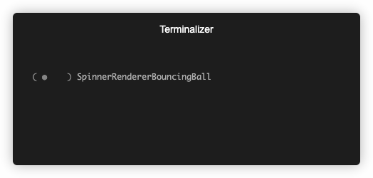

# Laravel Prompt Themes

[](https://packagist.org/packages/pjotrvdh/laravel-prompts-themes)
[](LICENSE.md)
[](https://packagist.org/packages/pjotrvdh/laravel-prompts-themes)

This package intends to provide themes for prompts

## Getting Started

### 1. Install

Run the following command:

```bash
composer require pjotrvdh/laravel-prompts-themes
```

### 2. Publish

Publish config file.

```bash
php artisan vendor:publish --tag=prompts-themes-config
```

### 3. Configure

You can change the prompts themes of your app from `config/prompts-themes.php` file

### 4. Examples
| Spinner                             | Example                                                                                       |
|:------------------------------------|:----------------------------------------------------------------------------------------------|
| SpinnerRendererAesthetic            |                      |
| SpinnerRendererArrows               |                            |
| SpinnerRendererBounce               |                            |
| SpinnerRendererBouncingBall         |                |
| SpinnerRendererBouncingBar          |                  |
| SpinnerRendererClock                |                              |
| SpinnerRendererDots                 |                                |
| SpinnerRendererDots2                |                              |
| SpinnerRendererDots3                |                              |
| SpinnerRendererDots4                |                              |
| SpinnerRendererDots5                |                              |
| SpinnerRendererDots6                |                              |
| SpinnerRendererDots7                |                              |
| SpinnerRendererDots8                |                              |
| SpinnerRendererDots9                |                              |
| SpinnerRendererDots10               |                            |
| SpinnerRendererDots11               |                            |
| SpinnerRendererDots12               |                            |
| SpinnerRendererDots13               |                            |
| SpinnerRendererGrowHorizontal       |            |
| SpinnerRendererGrowPulseHorizontal  |  |
| SpinnerRendererGrowPulseVertical    |      |
| SpinnerRendererGrowVertical         |                |
| SpinnerRendererHearts               |                            |
| SpinnerRendererLine                 |                                |
| SpinnerRendererMaterial             |                        |
| SpinnerRendererMoon                 |                                |
| SpinnerRendererNoise                |                              |
| SpinnerRendererPoint                |                              |
| SpinnerRendererPong                 |                                |
| SpinnerRendererSand                 |                                |
| SpinnerRendererSimpleDots           |                    |
| SpinnerRendererSimpleDotsScrolling  |  |
| SpinnerRendererSquareCorners        |              |
| SpinnerRendererTimeTravel           |                    |
| SpinnerRendererTriangle             |                        |
| SpinnerRendererWeather              |                          |

## Contributing

Pull requests are more than welcome. You must follow the PSR coding standards.

## License

The MIT License (MIT). Please see [LICENSE](LICENSE.md) for more information.
